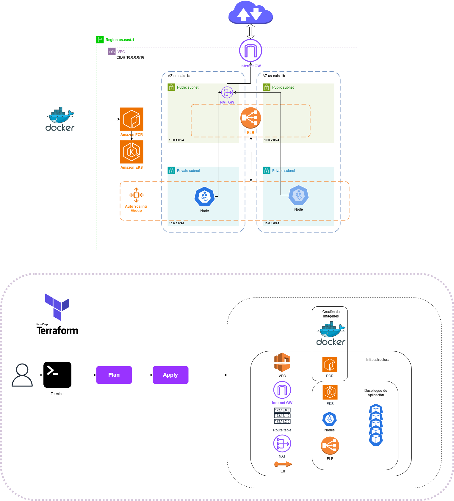
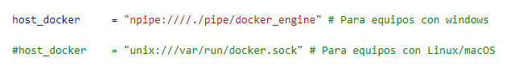
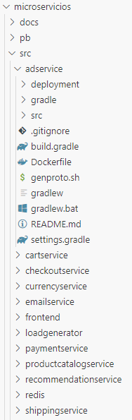
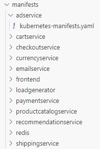
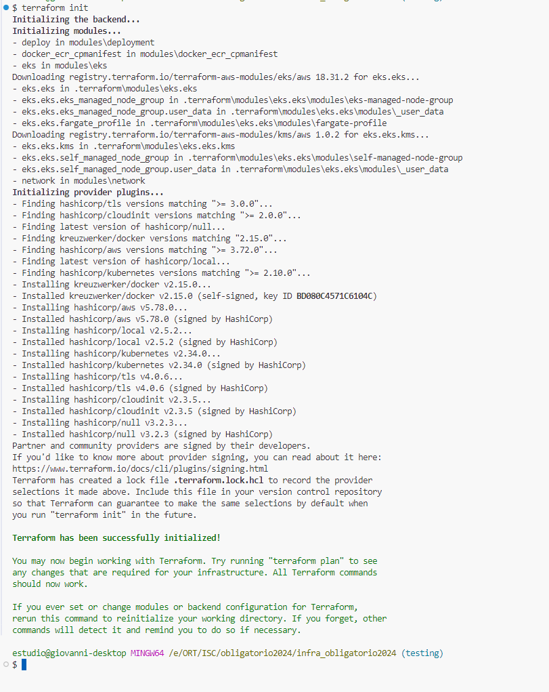
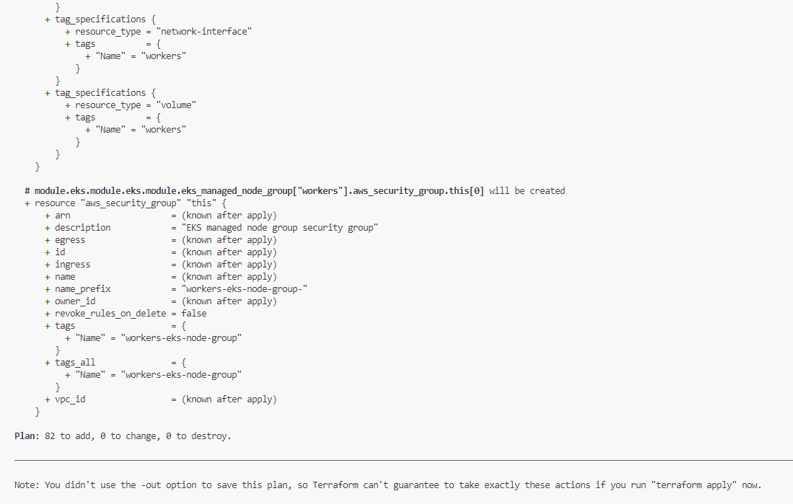
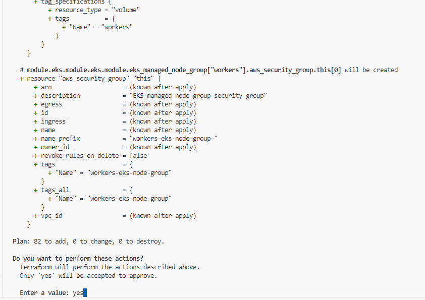
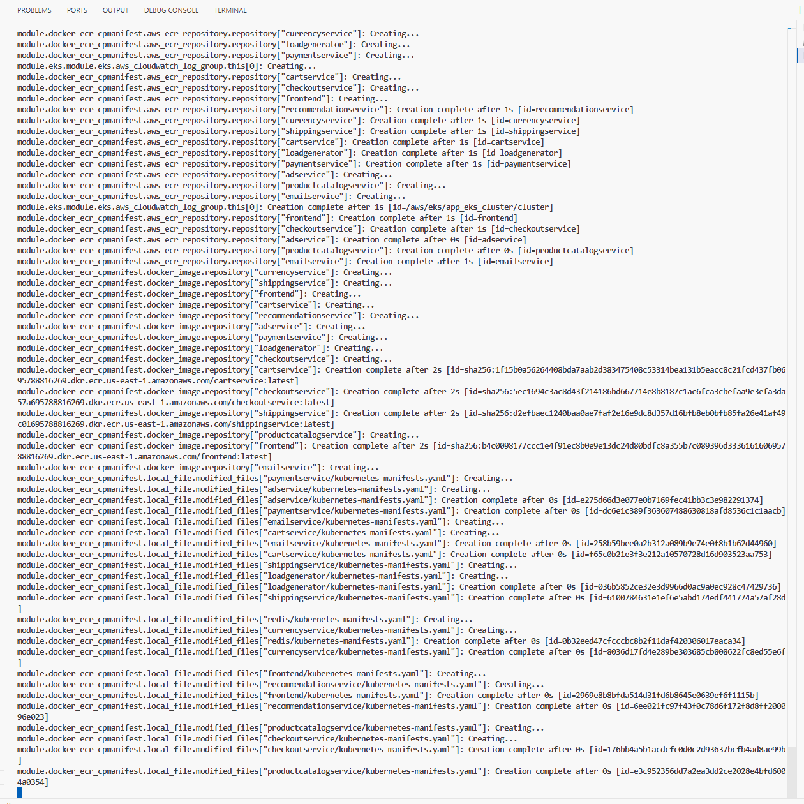
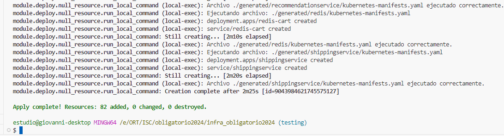

# Obligatorio Soluciones Cloud Diego Vazquez (302392) y Giovanni Storti (151234)
---

## Índice

- [Consigna](#consigna)
- [Requisitos previos](#requisitos-previos)
- [Servicios de AWS utilizados](#servicios-de-aws-utilizados)
- [Diagrama de arquitectura y despliegue](#diagrama-de-arquitectura-y-despliegue)
- [Estructura de Terraform](#estructura-de-terraform)
- [Variables de entrada](#variables-de-entrada)
- [Configuración de docker según SO](#configuración-de-docker-según-so)
  - [Para Windows](#para-windows)
  - [Para Linux/macOS](#para-linuxmacos)
- [Agregar nuevos microservicios](#agregar-nuevos-microservicios)
- [Modo de uso del repositorio](#modo-de-uso-del-repositorio)
- [Despliegue de la Infraestructura y Aplicaciones](#despliegue-de-la-infraestructura-y-aplicaciones)
- [Capturas de ejecución en Terraform](#capturas-de-ejecución-en-terraform)
- [Evidencia de despliegue](#evidencia-de-despliegue)
- [Destrucción de infraestructura y aplicaciones](#destrucción-de-infraestructura-y-aplicaciones)
- [Fallas a la hora de utilizar el destroy](#fallas-a-la-hora-de-utilizar-el-destroy)


---

## Consigna 

La startup “e-shop Services” ha decidido expandir sus operaciones por todo el mundo,
haciendo llegar sus servicios de e-commerce y retail, a todo el continente de América.
La competencia actualmente está posicionada en la región a la cual se quiere expandir, pero
los inversionistas están presionando para que “e-shop Services” expanda su marca ya que
de esto depende el seguir invirtiendo.

Se ha contratado a la consultora BitBeat para modernizar y desplegar la arquitectura e
infraestructura de su aplicación que actualmente corre en un datacenter on-premise. Para
esto, se requiere el despliegue de las aplicaciones, en ambientes basados en containers
(Docker, Podman, Kubernetes, etc)

---

## Requisitos previos

- **CLI AWS**
- **Docker**
- **Terraform** (utilizamos la v1.9.8)
- **Git**
- **kubectl** 
- **Configurar las credenciales de AWS CLI en el perfil a usar**
---

## Servicios de AWS utilizados

- **VPC**
- **Subnets**
- **Internet Gateway**
- **Route Tables**
- **Elastic IP**
- **NAT Gateway**
- **EKS** *(Gestiona los servicios que aquí se indican).*
  - EC2
  - Security Groups
  - ELB
  - Auto Scaling Group
- **ECR**


---
## Diagrama de arquitectura y despliegue




---

## Estructura de Terraform

```plaintext
INFRA_OBLIGATORIO2024
│   .gitignore
│   .terraform.lock.hcl
│   main.tf
│   README.md
│   terraform.tfvars
│   variables.tf
│   
├───.terraform
├───documentation_files
├───manifests
│   ├───adservice
│   │       kubernetes-manifests.yaml
│   ├───cartservice
│   │       kubernetes-manifests.yaml
│   ├───checkoutservice
│   │       kubernetes-manifests.yaml
│   ├───currencyservice
│   │       kubernetes-manifests.yaml
│   ├───emailservice
│   │       kubernetes-manifests.yaml
│   ├───frontend
│   │       kubernetes-manifests.yaml
│   ├───loadgenerator
│   │       kubernetes-manifests.yaml
│   ├───paymentservice
│   │       kubernetes-manifests.yaml
│   ├───productcatalogservice
│   │       kubernetes-manifests.yaml
│   ├───recommendationservice
│   │       kubernetes-manifests.yaml
│   ├───redis
│   │       kubernetes-manifests.yaml
│   └───shippingservice
│           kubernetes-manifests.yaml
│
├───microservicios
│   │   LICENSE
│   │   README.md
│   ├───docs
│   ├───pb
│   └───src
│       │   .gitignore
│       ├───adservice
│       │   │   Dockerfile
│       ├───cartservice
│       │   ├───src
│       │   │   │   Dockerfile
│       ├───checkoutservice
│       │   │   Dockerfile
│       ├───currencyservice
│       │   │   Dockerfile
│       ├───emailservice
│       │   │   Dockerfile
│       ├───frontend
│       │   │   Dockerfile
│       ├───loadgenerator
│       │   │   Dockerfile
│       ├───paymentservice
│       │   │   Dockerfile
│       ├───productcatalogservice
│       │   │   Dockerfile
│       ├───recommendationservice
│       │   │   Dockerfile
│       └───shippingservice
│           │   Dockerfile
│
└───modules
    ├───deployment
    │       deploy_k8s.sh
    │       main.tf
    │       variables.tf
    ├───docker_ecr_cpmanifest
    │       data.tf
    │       docker_build_push.tf
    │       ecr.tf
    │       generated_files.tf
    │       locals.tf
    │       providers.tf
    │       variables.tf
    ├───eks
    │       main.tf
    │       variables.tf
    └───network
            main.tf
            output.tf
            providers.tf
            route_tables.tf
            variables.tf
```
---

## Variables de entrada

Estos son los valores parametrizables que se pueden ajustar en el archivo `terraform.tfvars`.

| Name                         | Description                                | Type           | Default                                   |
|------------------------------|--------------------------------------------|----------------|-------------------------------------------|
| [app_eks_cluster](#input_app_eks_cluster) | Variable de nombre de Cluster             | `any`          | n/a                                       |
| [azone](#input_azone)         | Variable para la AZ                        | `list(string)` | `["us-east-1a", "us-east-1b"]`            |
| [desired](#input_desired)     | Variable cantidad deseada de nodos         | `number`       | `1`                                       |
| [host_docker](#input_host_docker) | Variable configuración de host según SO   | `any`          | n/a                                       |
| [instance_type](#input_instance_type) | Variable tipo de instancia               | `any`          | n/a                                       |
| [max](#input_max)             | Variable máximo de nodos                   | `number`       | `2`                                       |
| [min](#input_min)             | Variable mínimo de nodos                   | `number`       | `1`                                       |
| [network_cidr](#input_network_cidr) | Variable para CIDR                      | `any`          | n/a                                       |
| [private](#input_private)     | Variable de Subnet privada                 | `list(string)` | n/a                                       |
| [profile](#input_profile)     | Variable de Perfil de usuario              | `any`          | n/a                                       |
| [public](#input_public)       | Variable de Subnet pública                 | `list(string)` | n/a                                       |
| [region](#input_region)       | Variable de Región                         | `any`          | n/a                                       |
| [repository_list](#input_repository_list) | Variable lista de nombres de repositorios | `any`          | n/a                                       |


----
### Configuración de Docker según SO
Para la creación de las imágenes en Docker, es necesario ajustar en `terraform.tfvars` la configuración del socket del daemon de Docker según el sistema operativo:

#### Para Windows:
```hcl
host_docker = "npipe:////./pipe/docker_engine"
```
#### Para Linux/macOS:
```
host_docker = "unix:///var/run/docker.sock"
```
En este caso de ejemplo usamos para Windows, si se requiere usar en Linux o macOS es necesario descomentar la variable “host” para esos SO y comentar la de Windows 



---
### Agregar nuevos microservicios

Crear la carpeta que contenga el archivo `Dockerfile` en `microservicios/src/<nombre del servicio>/`.




  
Agregar el manifiesto YAML en `manifests/<nombre del servicio>/kubernetes-manifests.yaml`.




Agregar el nombre del servicio en la variable `repository_list`.

```
repository_list = [
  "adservice",
  "cartservice",
  "checkoutservice",
  "currencyservice",
  "emailservice",
  "frontend",
  "loadgenerator",
  "paymentservice",
  "productcatalogservice",
  "recommendationservice",
  "shippingservice"
]
```
----

# Modo de uso del repositorio

## Despliegue de la Infraestructura y Aplicaciones

Clonar el repositorio:
```
git clone https://github.com/Obligatorio-Sol-Cloud-302392-151234/infra_obligatorio2024.git
```
Acceder a la carpeta del repositorio:
```
cd infra_obligatorio2024
```
Ejecutar los comandos de Terraform:

-Inicializar configuraciones:
```
terraform init
```
-Crear plan de ejecución:
```
terraform plan
```
-Aplicar los cambios:
```
terraform apply
```
---

## Capturas de ejecución en Terraform

- terraform init
  


- terraform plan
  


- terraform apply
  



---

## Evidencia de despliegue







---

## Destrucción de infraestructura y aplicaciones.

Para eliminar toda la infraestructura y aplicaciones creadas utilizamos el comando:

```
terraform destroy
```

## Fallas a la hora de utilizar el destroy

- Como el ELB es directamente creado desde los manifiestos.yaml de Kubernetes al aplicar terraform destroy no tiene registro de ese recurso, por lo que hay que eliminarlo “a mano”
- Lo mismo sucede con un Security Group creado por EKS, no queda en .tfstate y no se elimina automáticamente. Es necesario esperar a que el proceso de destory llegue al final donde ya no tiene dependencias y se puede eliminar.   

---

## FIN


